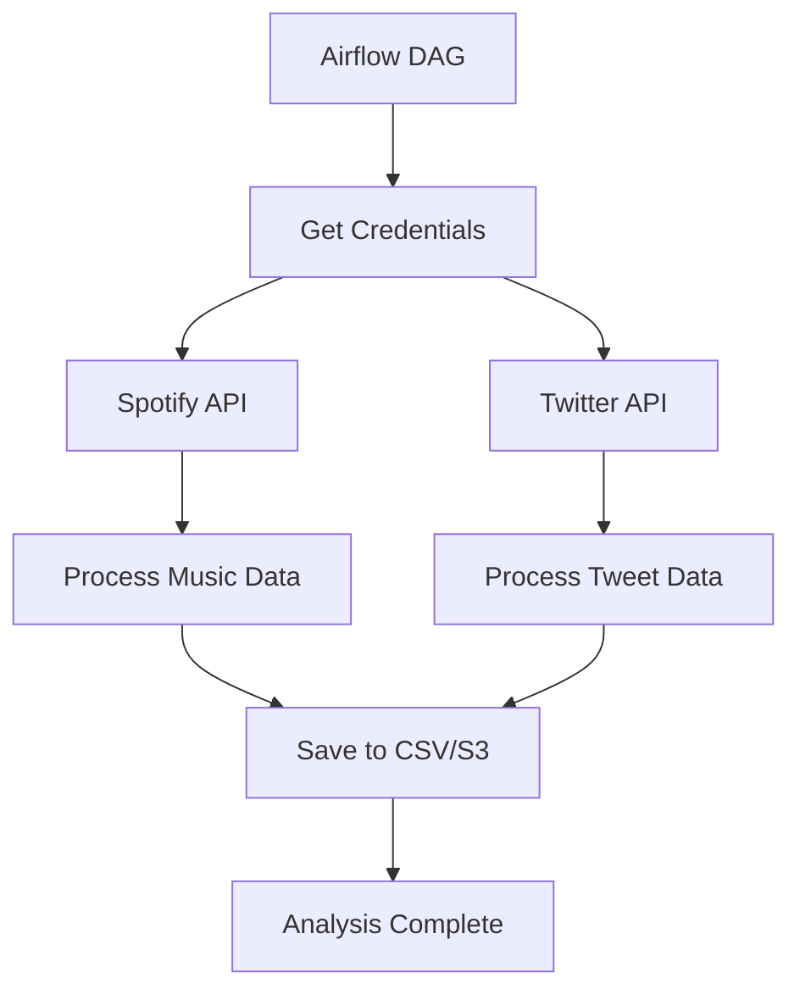

## 🏗️ Project Structure

```
Airflow project/
├── spotify_dag.py          # Main Airflow DAG (SECURED)
├── spotify_etl.py          # Spotify API ETL (REWRITTEN)
├── spotify_etl2.py         # Spotify recently played ETL (REWRITTEN) 
├── new.py                  # Spotify user analysis (FIXED)
├── songs.csv               # Sample data file
├── requirements.txt        # Python dependencies (NEW)
├── .gitignore
└── README.md              # This file
```

Create a `.env` file with your credentials:
```bash
# Get Spotify credentials from: https://developer.spotify.com/dashboard
SPOTIFY_CLIENT_ID=your_client_id
SPOTIFY_CLIENT_SECRET=your_client_secret

# Get Twitter credentials from: https://developer.twitter.com/portal
TWITTER_BEARER_TOKEN=your_bearer_token
```

### 3. Run Airflow
```bash
# Initialize Airflow
airflow db init

# Start Airflow (standalone mode for development)
airflow standalone
```

## 🛠️ Available DAGs/Scripts

| File | Description 
|------|-------------
| `spotify_dag.py` | Main Airflow DAG for Spotify ETL
| `spotify_etl.py` | Extract artist top tracks
| `spotify_etl2.py` | Extract recently played tracks

## 📊 Data Pipeline Flow



## 🔍 Testing

Test individual components:
```bash
# Test Spotify ETL
python spotify_etl.py


# Test Spotify user analysis
python new.py
```